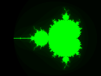
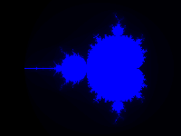
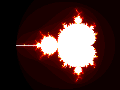

# Fractals SIMD

## Overview

Library containing following set of fractals implemented using SIMD:

|              | SSE3 | AVX2 |
|--------------|------|------|
| Mandelbrot   | +    | +    |
| Burning ship | +    | +    |
| Julia set    | +    | +    |

**Supported colormaps:**

Red, green, blue, gray, hot, jet:

## Renders

**Mandelbrot** (iteration limit = 50)

**Burning ship** (iteration limit = 50)

**Julia set, c = -0.1 + 0.65i** (iteration limit = 50)

**Julia set, c = -0.1 + 0.65i** (iteration limit = 10000)

