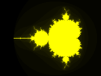
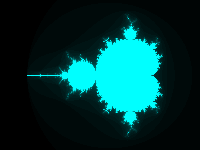
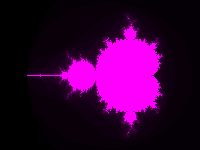

# Fractals SIMD

## Overview

Library containing following set of fractals implemented using SIMD:

|              | SSE3 | AVX2 |
|--------------|------|------|
| Mandelbrot   | +    | +    |
| Burning ship | +    | +    |
| Julia set    | +    | +    |

**Built-in colormaps:**

red, green, blue, yellow, cyan, magenta, gray, hot, jet

## Renders

**Mandelbrot** (50 iterations)

**Burning ship** (50 iterations)

**Julia set, c = -0.1 + 0.65i** (50 iterations)

**Julia set, c = -0.1 + 0.65i** (10000 iterations)

